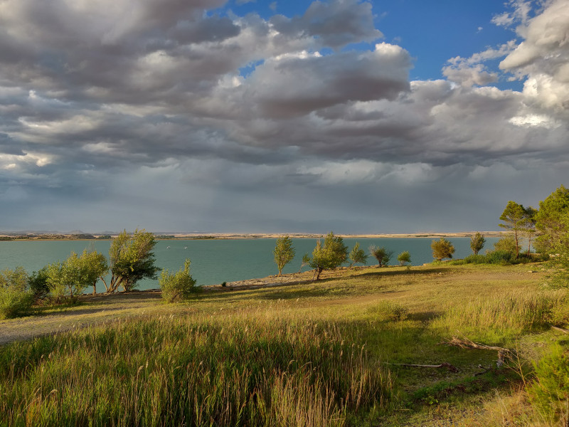
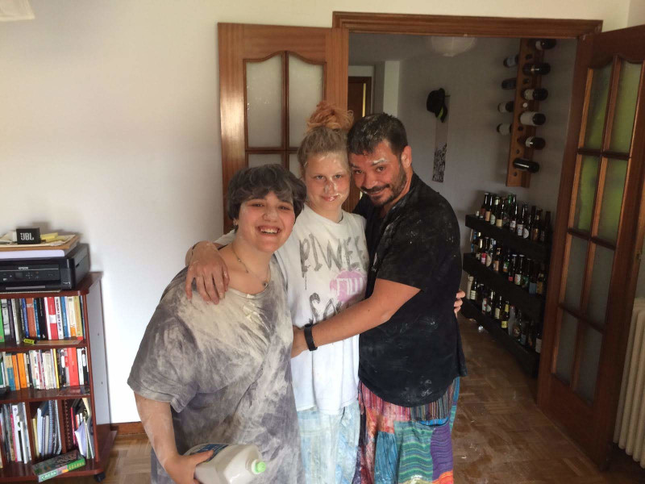
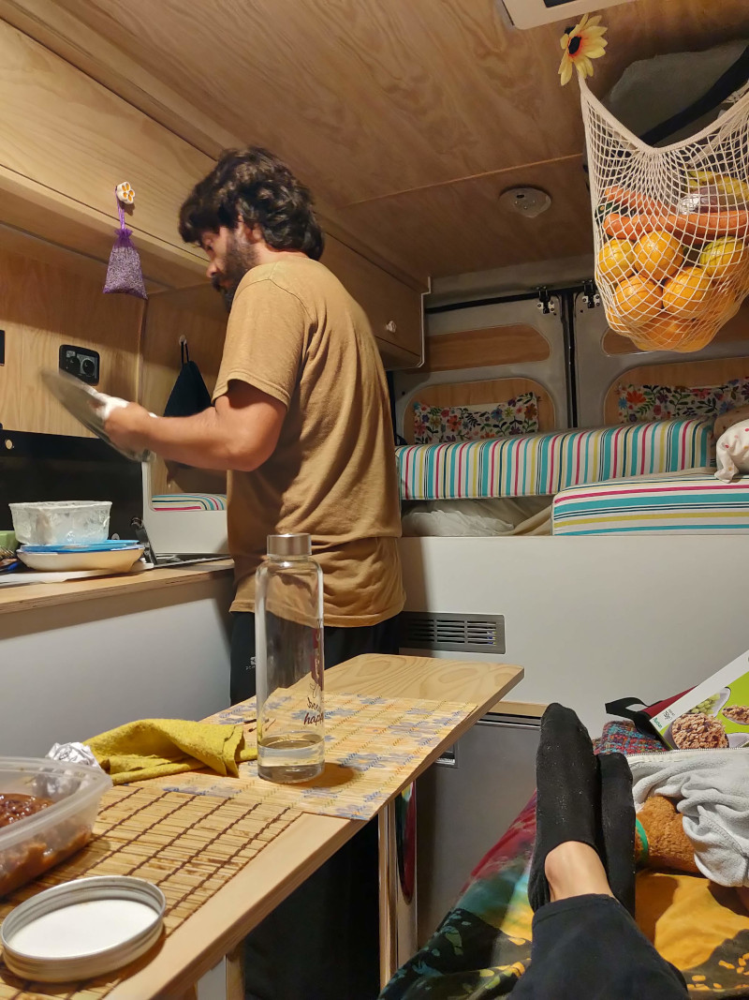
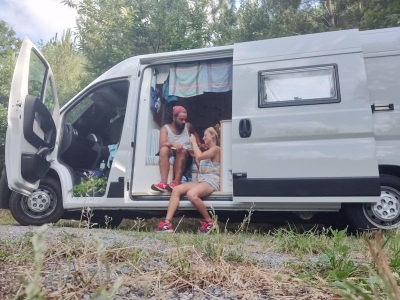
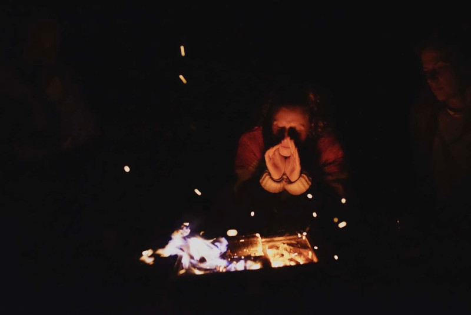
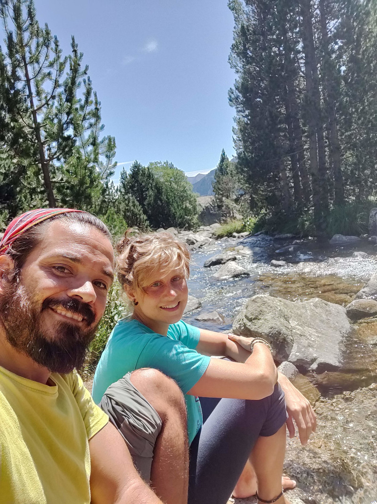
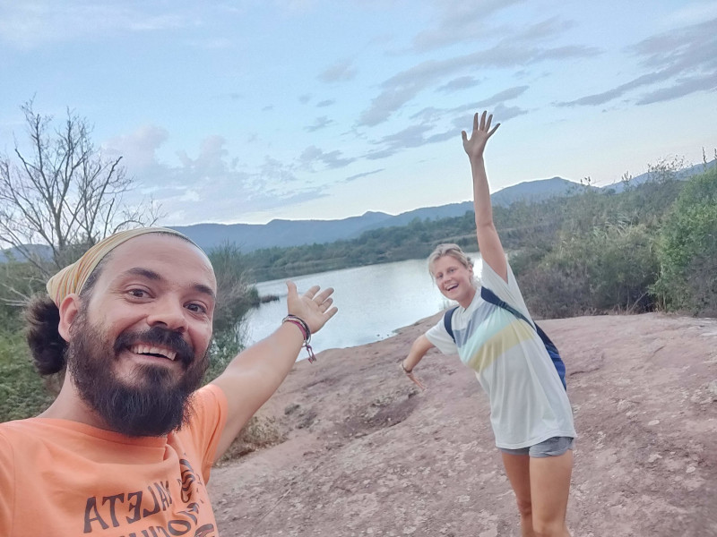

# El olor a pino

Por el título puede parecer que estamos obsesionados con los ambientadores de pino o algo por el estilo, pero nada de eso, de hecho no usamos ambientadores, preferimos el olor a naturaleza.

Muchas veces, cuando recordamos los lugares que hemos visitado, nos viene a la mente uno en particular, el Embalse de la Sotonera, en Huesca, no porque fuera el mejor sitio que visitamos, si no porque después de una tormenta bastante fuerte, nos vimos embriagados por un olor intenso a pino. Y os preguntaréis, ¿porqué seguir recordando ese olor? Pues porque nos recuerda a libertad, a naturaleza y a aventuras.

Ambos somos amantes de la naturaleza, no solo de las montañas, si no de las playas también y de todo aquello evoca un sentimiento de libertad. Nos gusta visitar las ciudades, claro, pero somos unos enamorados de la libertad, y en parte, la decisión de irnos a vivir a una furgoneta vino dada por eso, queríamos conocer el mundo, pero no ese mundo de las grandes ciudades, queríamos perdernos en los Pirineos, en la playas de Portugal, visitar la costa de Marruecos, los atlas o hasta perdernos en la Patagonia Argentina.

## En busca de esa libertad

En nuestra sociedad, desde pequeños, nos enseñan que tienes que dar una serie de pasos para hacer que tu vida sea una vida plena, es decir, tienes que comprarte una casa, tener un trabajo, … bueno, lo que ya todos sabéis. Esta fórmula puede que funcione para muchos, pero lo bonito del ser humano es que todos somos diferentes, no queremos las mismas cosas y es por esto que esta fórmula no es válida para todos. Algunos no queremos establecernos en un lugar, queremos conocer el mundo, experimentar esa sensación de libertad por nosotros mismo y ser dueños de nuestras decisiones y nuestras vidas.

Durante algunos meses, antes de tener la Flowerneta, estuvimos viviendo en Madrid y luego en Conil de la Frontera, Cádiz. Dos lugares muy distintos, pero con encanto. Aunque los disfrutábamos mucho, al cabo de un tiempo nos cansábamos, y pensábamos cómo sería vivir aquí o allí, viajar a este sitio durante unos meses, perdernos en la montaña durante unas semanas, etc, queríamos ser libres y estar en el lugar que queríamos cuando quisiéramos.

No somos ricos, pero si soñadores y por ello hemos llegado a donde estamos ahora mismo, escribiendo este post en medio de un pinar en Portugal cerca de Praia do Pego, porque es donde queremos estar hoy, y mañana … ya veremos.

## Para una temporada esta bien

Esto es lo que nos dicen muchas personas, e incluso hay veces que nos hacen pensar, pero siempre llegamos a la misma conclusión, ¿porque tiene que ser una temporada? Una de las cosas que más oímos es que tarde o temprano, necesitaremos una casa, para echar raíces, formar una familia, … y ya os sabéis el resto pero nosotros siempre contestamos lo mismo: ya tenemos una casa, la Flowerneta. Y si, aunque no se corresponde a la imagen de una casa que se os puede venir a la mente, para nosotros es nuestra casa, ahí tenemos nuestra vida, nuestras cosas más valiosas, y donde hemos y seguimos pasando malos, y sobre todo, buenísimos momentos. Es una casa pequeña pero que nos permite seguir viviendo como queremos, nos permite decidir sobre dónde queremos vivir hoy y cómo queremos vivirlo, en definitiva, nos permite ser libres.

Es una casa pequeña, sin apenas comodidades, pero nos cubre con creces nuestras necesidades, nos hemos adaptado para poder vivir de la manera que queremos, y además, tenemos algo que nunca habíamos tenido en nuestras casas anteriores, tenemos un jardín enorme, y tenemos que recorrerlo.

## El mundo es nuestro jardín

Habréis leído y oído esta frase en muchísimos lugares, y sobre todo en aquellos relacionados con el mundo camper, pero es que es verdad. En nuestro caso, la Flowerneta es nuestra casa, y con ella podemos viajar e ir donde queramos, por lo que el mundo, podríamos decir, que es nuestro jardín. Enorme, tan grande que nos haría falta otra vida para poder recorrerlo entero, pero es algo en lo que queremos y ponemos nuestro empeño en hacer ahora mismo. Somos libres de ir donde queremos, pero también somos libres de parar si llega ese momento.

Imaginaos esa sensación de estar hoy en Portugal como nosotros, y en 1 mes, estás en Alemania visitando la selva negra, para 2 meses después, estar viendo las auroras boreales en Noruega, … podéis seguir imaginando sitios, viviendo en una casa rodante todo esto es posible.

No existen pinos en todos los lugares del mundo, por supuesto, pero nosotros seguiremos recordando este olor, como hemos dicho significa libertad, y vida, en concreto, es nuestra forma de vivir nuestra vida de forma libre.

## Pero, y la familia?

No echar raíces en un sitio no significa que te olvides de las que ya tienes. Como cen nuestros padres, se puede ir donde uno quiera, la familia siempre estará ahí. No todo el mundo puede decir esto, por desgracia, pero en nuestro caso si podemos decirlo, nuestra familia siempre está ahí, tanto nuestra familia gaditana como la italiana, igual que nuestros amigos. Está claro que con este tipo de vida no se les puede visitar todos los meses, pero si hablar con ellos y de vez en cuando, visitar y volver a tus raíces, para nosotros, es como una forma de retomar fuerzas, unirnos con los nuestros un tiempo, y volver a seguir nuestra aventura.

La familia no está reñida con la libertad, es algo que en esta sociedad nos han enseñado y que creemos que es algo errado pensar eso, ya que en los tiempos en los que estamos, la comunicación es poder, y es relativamente fácil comunicarnos con otras personas.

## Desaprender para ser libres

Es lo que intentamos hacer nosotros, y es que es un ejercicio muy interesante, poner en duda todo lo que has aprendido (o casi todo) para, en este caso, aprender por uno mismo. Nosotros, con la furgoneta y nuestra nueva vida, comenzamos desde 0, sin tener ni idea de que nos depararía el futuro, como iba esto de vivir en una furgoneta y demás, y hemos aprendido, seguimos aprendiendo y aprenderemos muchísimo más, pero es gratificante ver como creces en este aspecto y que todo lo que hacemos o conseguimos es gracias a nuestro esfuerzo.

Y es que desaprender es otra forma de liberarse también, de ser y sentirse libre, ya que te separas de esas reglas establecidas por la sociedad para replanteartelas y recapacitar sobre ellas.

## Libres y "asalvajaos"

Así es como de cariño, nos decimos entre nosotros, que estamos "asalvajaos", y en parte esa así, es porque estamos aprendiendo, pero sobre todo, estamos aprendiendo a ser libres, y a disfrutar nuestra vida como queremos y dónde queremos, en la naturaleza y el mundo.

Por eso, desde nuestro pequeño mundo os animamos a que os replanteéis las cosas, luchéis por lo que queréis pero sobre todo, que seais y os sintáis libres. El significado de libertad lo pone cada uno, al igual que los límites, pero lo importante es que al igual que nos ocurre a nosotros, podáis decir y sentir que sois libres.

