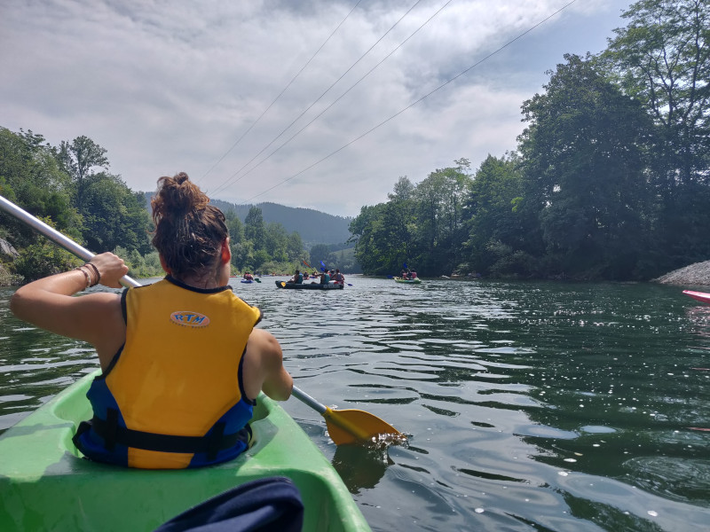
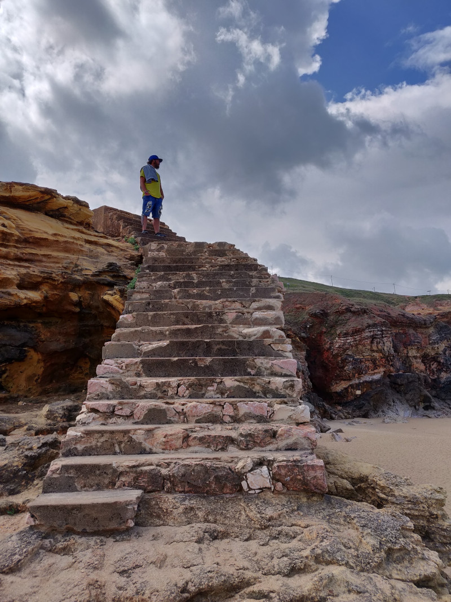
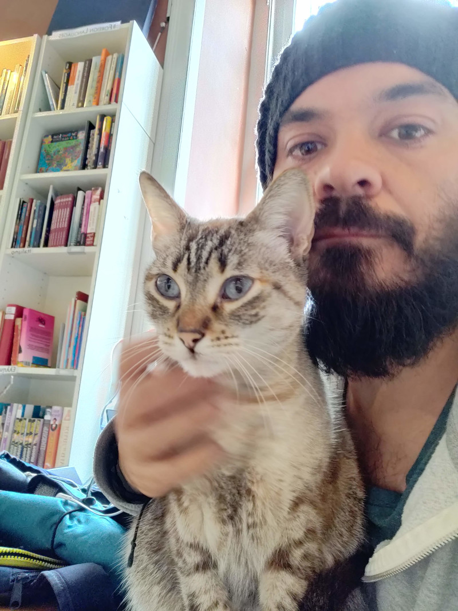
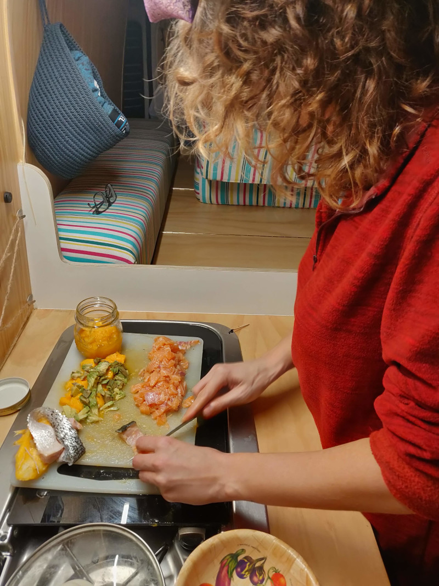
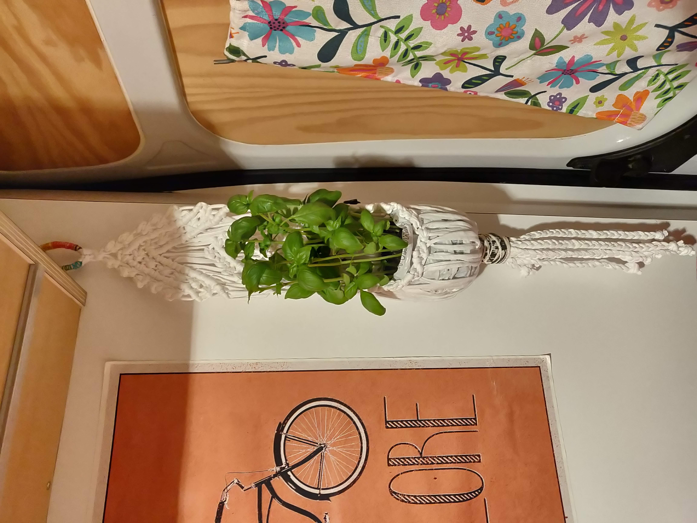
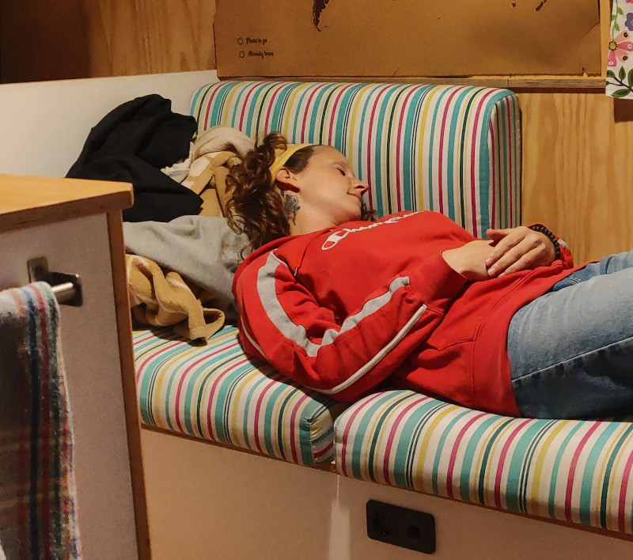
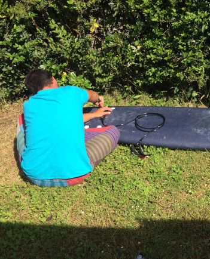
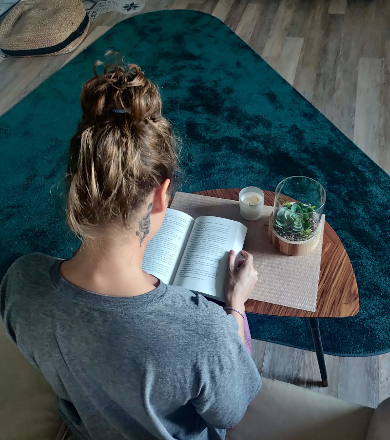
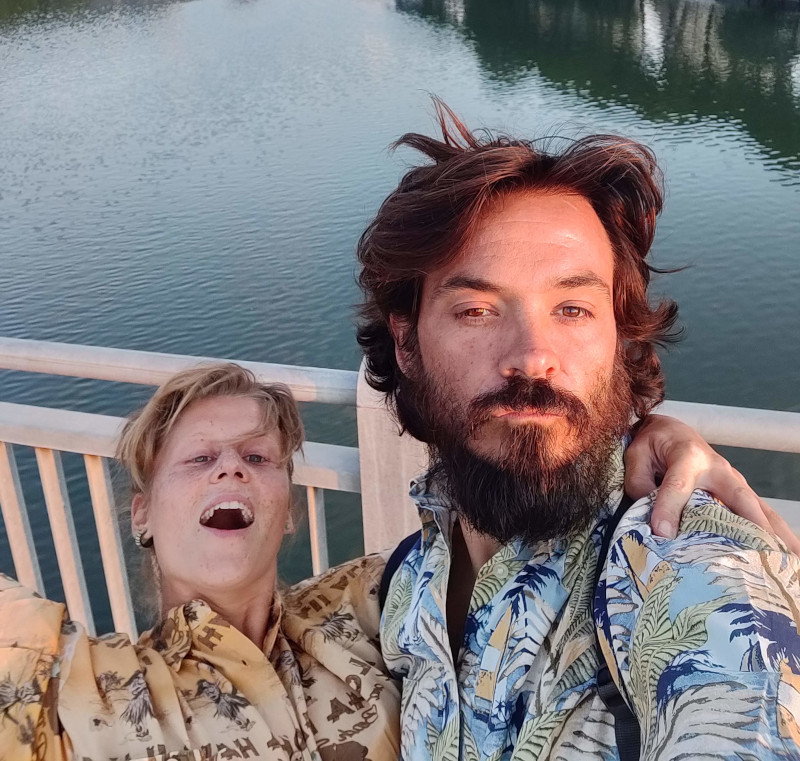

# Chi c’è dietro Donde la locura nos lleve

Se non l’avete ancora capito, ve lo diciamo noi: abbiamo proprio la testa fra le nuvole. È quasi un anno che viaggiamo in camper e che raccontiamo le nostre avventure su Instagram, abbiamo appena iniziato a scrivere questo blog, ma non ci siamo ancora presentati.

Iniziamo dicendo che siamo persone simpatiche, socievoli, allegre, ci piacciono le cose semplici e ben fatte e, beh, che non ci piace per niente autodefinirci. Ma, in fondo, a chi piace descrivere se stesso? Proveremo comunque a farlo, però a modo nostro. Chiediamo a tutti quelli che già ci conoscono di aiutarci a descriverci nei commenti, così che anche i nuovi possano farsi un’idea di ciò che pensa la gente di noi (aiuto!)

## L’avventuriera

Possiamo dire che siamo entrambi due avventurieri e che ci piace tanto (per non dire troppo) viaggiare, conoscere nuove culture e perderci per boschi, spiagge, montagne, un po’ ovunque. Ma se proprio dovessimo scegliere, l’avventuriera sarebbe Fede. Come la definiscono molti dei suoi amici, è uno spirito libero. E che c’è di meglio di vivere in un furgone, in costante movimento? È profondamente innamorata della natura e della montagna, dei sentieri senza fine con dislivelli di 12983721987298424 km che ti tolgono il fiato mentre li percorri e, ancora di più, quando arrivi in cima. Anche la spiaggia le piace molto, ma diciamo che si annoia presto.

## Il sognatore

Sogna sempre a occhi aperti, tanto che spesso sembra trovarsi in un’altra dimensione. José è nato che stava già sognando, non solo perché è un dormiglione (verissimo), ma perché sogna cose che sembrano impossibili, e ci mette tutto se stesso perché diventino realtà.

## La sportiva

Entrambi amiamo fare sport, ma quella che proprio non riesce a stare seduta due minuti è Fede. Cerca sempre di provare nuovi sport e attività, non riesce a stare neanche una settimana senza andare a correre, seguire un sentiero di montagna, fare skate o surf.

## L’influencer

Potremmo dire che l’influencer ê Paco (la nostra volpe di peluche) 🤣 Entrambi usiamo i social come Twitter o Instagram (dove abbiamo preso molte idee per la Flowerneta) ma siamo mooolto poco attivi, come avrete già notato. José è il più bravino, o almeno quello che ha più voglia di pubblicare cose e migliorare la nostra presenza, mentre Fede scappa appena sente la parola “pubblicare” o, se proprio non ha via di fuga, cerca sempre di proporre qualcos’altro da fare.

## La chef

Ufff questa è più difficile. Entrambi adoriamo cucinare (si nota nella nostra página Instagram, vero?) e provare piatti nuovi. Ricorriamo spesso al blog Giallo Zafferano e all’app Nooddle (ve ne parleremo più tardi) per provare nuove ricette. Anche se a entrambi piace cucinare, è Fede quella che innova di più con i sapori e cambia spesso le ricette, mentre per José è impensabile non seguire una ricetta alla lettera (“qua dice 2 grammi di sale, mi prendi la bilancia?”). Quindi il premio Grande Chef se lo aggiudica Fede.

## Il pollice verde

…. eh nessuno! Abbiamo provato a piantare il basilico, i pomodori, il prezzemolo, di tutto e di più, ma le piantine ci muoiono sempre! Abbiamo provato in tutti i modi, José a volte si mette persino a cantare alle piante, ma niente, loro continuano ad appassire… Sarà che José canta proprio male.

## La disordinata

Come sapete, nella Flowerneta c’è un divano ad L che usiamo per molte cose, anche per appoggiarci i vestiti, e in questo Fede è la campionessa indiscussa. Come direbbe la madre di José, nel furgone abbiamo il “Monte Gurugú”, che è una montagna di vestiti che esiste in ogni casa e di solito nasce da una sedia o, nel nostro caso, dal divano. L’equilibrio che permette la prosperità di questa montagna è molto fragile, da un lato abbiamo Fede che lo mantiene in vita e, dall’altro, Josè che vorrebbe farlo sparire.

## Il ciappinaro

O meglio, quello che ci prova, è José. Se si rompe qualcosa, lui ci mette tutto l’impegno e la concentrazione del mondo per aggiustarlo, anche se a volte capita che peggiori le cose.

## La divoratrice di libri

Se fosse per Fede, il van sarebbe piena di libri, anche a costo di dover dormire fuori. Adora l’odore dei libri e toccarne le pagine. Ma siccome nel van non c’è tanto spazio, si accontenta di leggere con il suo libro elettronico.

## Il matto da legare

Entrambi! Siamo una coppia particolare e un po’ strana, perché condividiamo gusti e passioni ma se c’è qualcosa che davvero ci accomuna è che siamo entrambi matti da legare. Ma dei matti buoni. Ci riempie l’entusiasmo di conoscere il mondo senza nessun limite, di sapere cosa ci regalerà questa vita che abbiamo iniziato, ma che non sappiamo dove ci porterà. Quindi perché non lasciarsi andare e scoprirlo?

