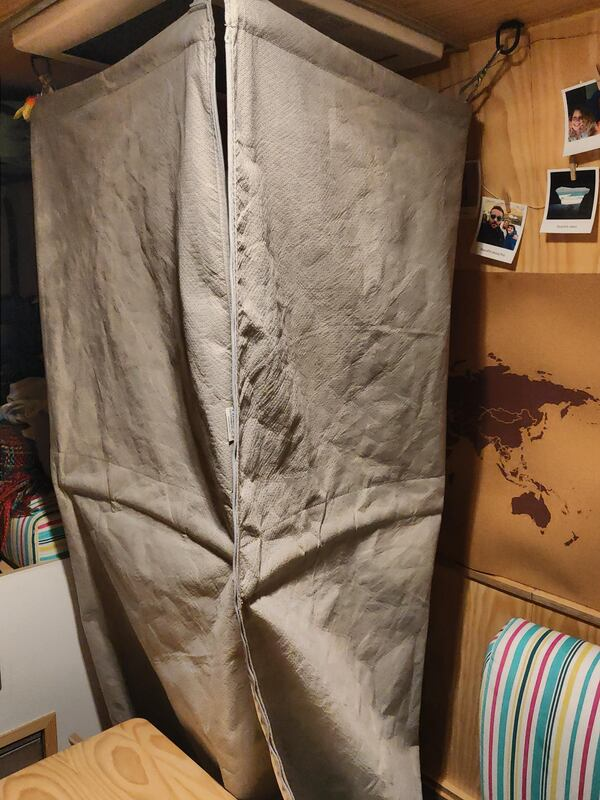
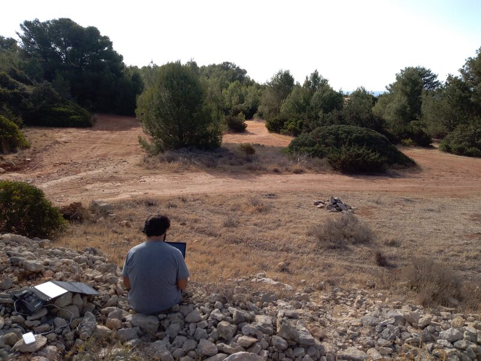
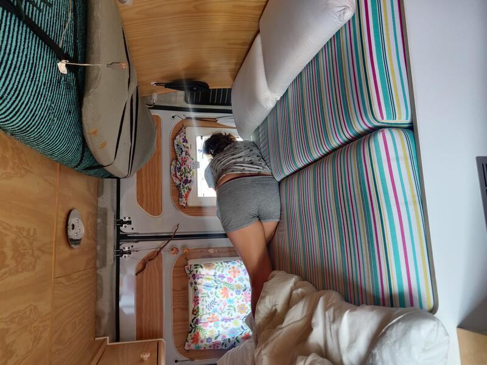
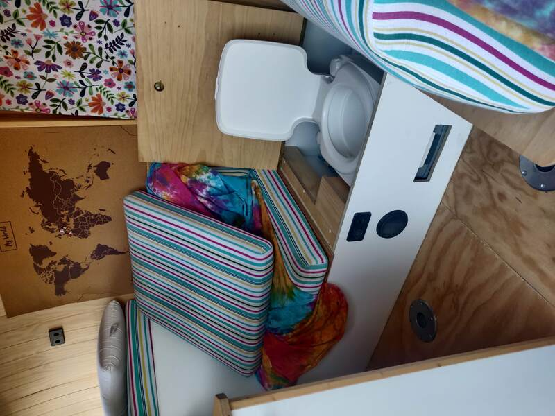

# Vivere in un furgone e non morire nel tentativo. Il bagno

In un vecchio post vi abbiamo descritto la nostra cucina e come si è trasformata nel nostro piccolo laboratorio di esperimenti culinari.

Oltre alla cucina, come potete immaginare, nel furgone abbiamo anche un bagno. Anche se forse chiamarlo bagno non è proprio corretto, perché non abbiamo una vera e propria stanza, ma l’abbiamo distribuito all’interno del van. Ora vi spiegheremo meglio com’è fatto e come si usa.

## Il bagno

Il bagno è senza dubbio una delle cose che suscita più curiosità perché, come vi abbiamo già spiegato, il van non ha nessuna separazione degli spazi, quindi quando entri dalla porta, non vedi nessun bagno. Ora capirete perché insistiamo tanto nel dire che vivere in un unico spazio aperta comporta alcune rinunce, prima tra tutte, quella dell’intimità (anche se a volte riusciamo a rimediare).

Nel nostro caso, il water, che d’ora in poi lo chiameremo con il suo vero nome, Potty (e no, non ce lo siamo inventato, si chiama proprio così), è “nascosto” dentro al divano. Proprio come la doccia, che è sempre nascosta in un altro punto del divano. Questa disposizione ci regala un sacco di spazio nel van, ma è vero che bisogna imparare ad organizzarsi bene.

## Operazione Cacca

È arrivato il momento di rispondere alla fatidica domanda: ma se non avete una stanza-bagno, come fate la cacca? La risposta è: dipende dal tempo. Ma non il tempo dell’orologio, no no, proprio il tempo atmosferico.

La primissima cosa che bisogna fare è avvisare chi vive con te nel van e dichiarare l’inizio dell’Operazione Cacca. Innanzitutto bisogna smontare il divano (almeno la parte dove è nascosto il Potty), aprirlo, inserire con cura un sacchetto di plastica, et voilà, il Potty è pronto per essere usato! E cosa fa l’altra persona? Beh, come abbiamo detto, dipende dal tempo.

Se il tempo è bello, si va a fare un giretto, ad ammirare il panorama, raccogliere un mazzo di fiori, ecc… Ma se il tempo è brutto? Se è notte, fa freddo e piove? Nel van non abbiamo neanche un ombrello, quindi abbiamo due opzioni: o si mette l’impermeabile e si diverte a ballare sotto la pioggia, o mette in atto la modalità sopravvivenza: sdraiarsi sul letto, aprire la finestra, infilarci la testa e cercare di sopravvivere! Ovviamente preferiamo la prima opzione, ma in certe situazioni non abbiamo proprio scelta. Dopo tutto questo, come immaginerete, fare la pipì è un gioco da ragazzi!

## José, il supereroe

Ci sono cose che adoriamo fare entrambi, come cucinare, e altre che odiamo. José, per esempio odia fare il letto, quindi lo fa sempre Fede, José, in cambio, è quello che si occupa della pulizia del Potty (una cosa che Fede proprio non sopporta). 

Nel van evitiamo i prodotti chimici come la peste, e lo facciamo per 3 ragioni:

1. il prezzo altissimo (soprattutto dei prodotti per la pulizia del Potty)
2. per rispettare l’ambiente in cui viviamo
3. per non dipendere dalle zone abilitate allo svuotamento dell’acqua sporca (e allo smaltimento di questi prodotti)

Per questo abbiamo scelto un’opzione più ecologica, pratica, economica e che si adatta meglio al nostro stile di vita. Potremmo riassumere in: aceto, bicarbonato e sacchetti di plastica (e se sono biodegradabili, ancora meglio).

L’aceto, con la sua acidità, è un ottimo disinfettante, quindi lo usiamo per pulire il potty, aggiungendo un po’ d’acqua e bicarbonato.

Come avrete intuito, i sacchetti di plastica servono per evitare di fare la cacca direttamente nel potty (se no sarebbe troppo difficile pulirlo senza prodotti chimici). Quelli che hanno un cane, avranno già capito. Si mette un sacchetto all’interno del Potty e, una volta terminata l’operazione, si chiude con un bel nodo e si butta in un cestino. 

Per questo diciamo che serve molta organizzazione per usare questo tipo di bagno: non si può assolutamente aspettare l’ultimo minuto per decidersi ad andare in bagno, perché come vedete, la procedura è abbastanza lunga.

## La goccia che fa traboccare il Potty

Con un water normale, si può tirare l’acqua e tutto sparisce come per magia. Inutile dire che, con il Potty, questo non succede.

Essendo il Potty uno spazio chiuso, come una scatola, ha una capacità limitata. Bisogna fare molta attenzione a questo limite perché non si può assolutamente superare! Penserete che la soluzione è facile: si svuota tutto e basta. A volte però non è così semplice. Anche se non usiamo prodotti chimici, ovviamente non possiamo rovesciare 10 litri di pipì in un tombino nella piazza del paese, bisogna comunque trovare un posto appartato, dove non diamo fastidio a nessuno, ancora meglio se una zona di scarico per camper. Per questo, spesso è necessario spostarsi con il van. Oh oh, sapete tutti cosa succede se si guida con un contenitore non ermetico in macchina, vero? Al primo dosso, alla prima curva e alla prima frenata, il liquido esce dal contenitore.  Ovviamente se il Potty non è troppo pieno non succede niente, ma se si supera il limite… Noi l’abbiamo superato ben 2 volte, e vi assicuriamo che non è piacevole. Questo per dirvi che è importantissimo tenere tutto sotto controllo, soprattutto la famosa goccia che fa traboccare il vaso (o in questo caso, il Potty).

## La natura provvederà

Molte volte è proprio così, anche per quanto riguarda il bagno. Spesso siamo soli in mezzo alla natura, con il van parcheggiato nel bel mezzo di una pineta o in qualche angolo sperduto in riva ad un lago. Dopo tutta questa spiegazione, siamo sicuri che capirete l’importanza di fare la pipì all’aria aperta, per evitare di doverci preoccupare di tutto il resto.

Ovviamente il nostro bagno non è comodo come quello di una casa “normale”, ma copre perfettamente le nostre necessità. Noi poi troviamo sempre il lato divertente: ridiamo quando si annuncia l’inizio dell’Operazione Cacca, cercando di non fare troppo rumore se ci sono altre persone fuori, vicino al furgone. Ci raccomandiamo sempre a vicenda di aprire tutte le finestre e, al termine dell’operazione, stabiliamo un tempo di quarantena prima di rientrare in casa.
