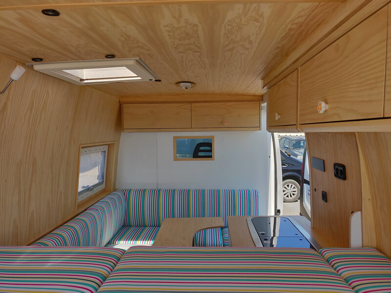
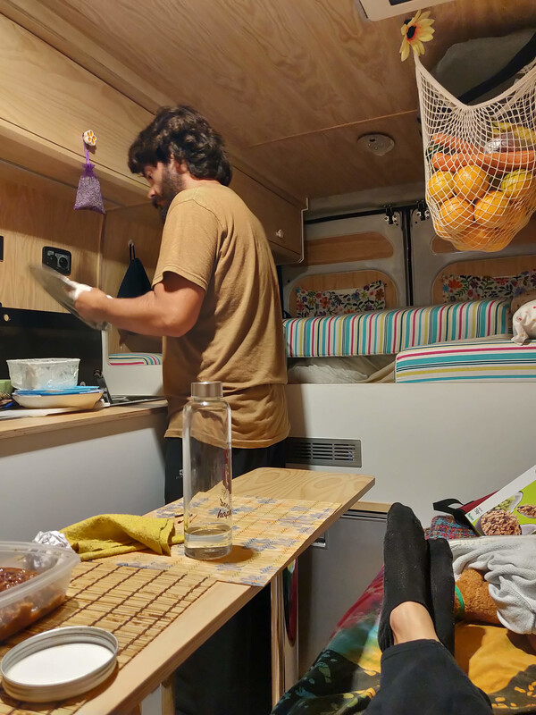
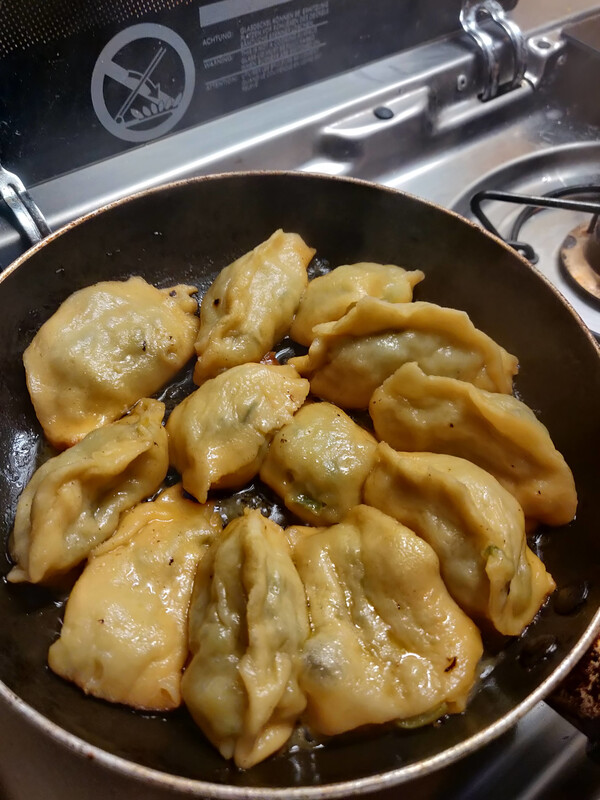
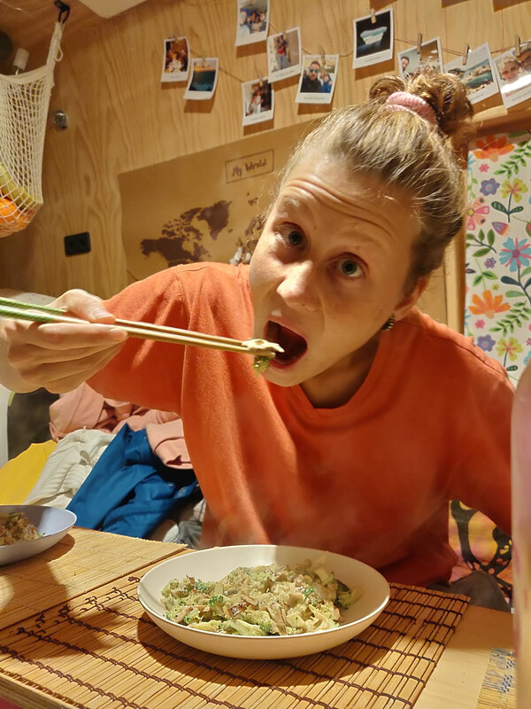
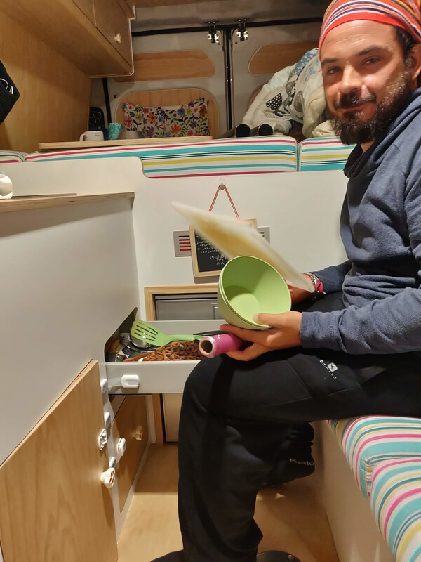
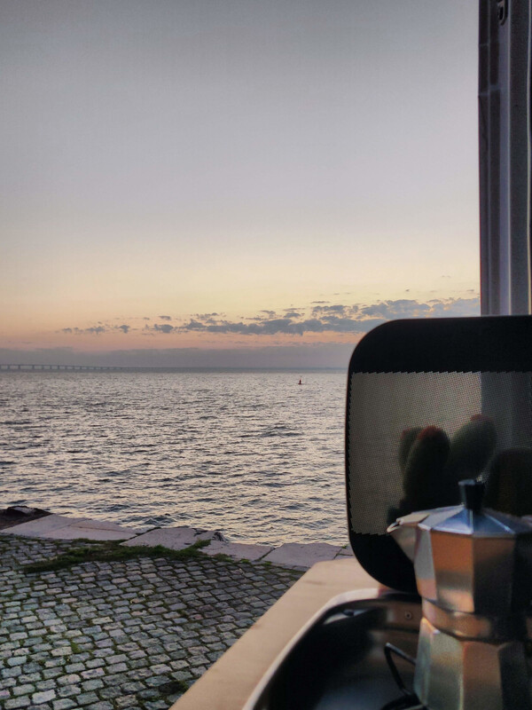

# Vivere in un furgone e non morire nel tentativo. La cucina

Vivere in un furgone viaggiando per il mondo… Sembra stupendo (e lo è), ma ci sono alcune cose che dobbiamo considerare. La prima di tutte sono le dimensioni.

## La divisione degli spazi

Di solito, quando pensiamo ad una casa, ci immaginiamo le varie stanze: il bagno, la cucina, la camera da letto… In un furgone, questa divisione degli spazi, beh… come spiegarlo… non esiste. In effetti è tutto un unico spazio.

Quando abbiamo iniziato a disegnare il progetto del furgone, abbiamo optato per un unico spazio aperto, senza pareti e senza nessun tipo di bagno fisso che avrebbe occupato un sacco di spazio. Volevamo sfruttare al massimo gli 8 metri quadrati che avevamo a disposizione. Un anno dopo, siamo felicissimi della nostra decisione: un unico spazio aperto fa sembrare la casa più grande e accogliente. È anche vero però che questa scelta comporta qualche “sacrificio”.

## Cucinare in salone

Cucinare è una piccola ma grande sfida. Adoriamo cucinare e provare piatti nuovi, ma è vero che non viviamo nel posto migliore per fare una pizza (ma noi la facciamo lo stesso eh).

Poco dopo il trasloco, ci siamo resi conto che per noi, la nostra cucina è troppo piccola. È per questo che a volte capita che mentre uno scalda l’acqua per la pasta, l’altro taglia le verdure… seduto sul divano! Tagliare le verdure non è mai stato un processo così comodo! Quanti di voi hanno mai tritato la cipolla seduti sul divano? È un’esperienza abbastanza divertente, ma altamente pericolosa. Finché sono cose relativamente secche, come cipolle e patate, va beh, ci può anche stare. Ma non azzardatevi a tagliare i pomodori. Questo è un vero e proprio sport estremo. 

## Esperimenti in cucina

Cucinare nel furgone è esattamente come cucinare in una casa, possiamo fare tutti i piatti che vogliamo, l’importante è sapersi organizzare. Poco fa, per esempio, abbiamo fatto per la prima volta i ravioli cinesi, e sono venuti buonissimi! La prima cosa da fare è l’impasto: acqua e farina. Facile, ma vi assicuriamo che il poco spazio che abbiamo, l’abbiamo sporcato tutto. Alla fine c’era più farina per terra che sulla tavola. Per evitare questo tipo di disastri, bisogna organizzarsi ed imparare a fare le cose senza fretta e con moltissima pazienza. Prima si prepara l’impasto, poi si fa un po’ di ordine, si fa il ripieno, poi si fa un altro po’ di ordine, e solo alla fine, si può iniziare a cuocere i ravioli.

Alcune persone ci chiedono: Ma come fate senza microonde? E senza forno? Beh, la parte del microonde è facile, in effetti anche prima non lo usavamo quasi mai, solo per scaldare il latte per la colazione. Ora non sentiamo la mancanza del microonde, scaldiamo il latte nel nostro super pentolino dell’Eurospin (lo adoriamo!).

Il forno è tutta un’altra storia. Per fortuna l’anno scorso Babbo Natale ci ha regalato il forno Omnia, una delle invenzioni più importanti dell’umanità. È una specie di pentola con un buco in mezzo, come uno stampo per ciambelle. Non sappiamo esattamente come, ma il modo in cui propaga il calore fa sì che il cibo si cucini come in un forno. Abbiamo provato tante ricette, come il pollo al forno, i salatini di pasta sfoglia, il pesce… Il risultato non è uguale uguale a quello di un forno vero e proprio, ma ci si avvicina molto. Noi continueremo a fare pratica, prima o poi impareremo anche a gratinare!

La cucina che abbiamo è una Dometic con due fornelli ed un lavandino. Per il gas, usiamo una bombola di 6 chili. È vero che questo tipo di cucina è abbastanza comodo, perché il lavandino e i fornelli hanno una specie di coperchio di vetro, quindi si possono chiudere e sopra possiamo appoggiare il tagliere e altre cose. Però dobbiamo riconoscere che un po’ più di spazio non ci farebbe male!

Ah, la bombola di gas! A noi una di 6 chili ci dura circa 3 mesi cucinando tutti i giorni. È vero che la usiamo SOLO per cucinare, ma non possiamo lamentarci, ci dura un sacco di tempo. 

## Lavare e asciugare, asciugare e lavare

Lavare i piatti è un’altra cosa importante che bisogna fare poco a poco. Non riusciamo quasi mai a cucinare e lavare i piatti allo stesso tempo, quindi anche in questo caso è importante organizzarsi. Anche se non lo facciamo sempre, cerchiamo di lavare i piatti subito dopo pranzo/cena per evitare che il lavandino sparisca sotto pentole e piatti. Di solito uno (José) lava i piatti e l’altro (Fede) asciuga. L’”asciugapiatti” è libero di scegliere il livello di comodità del processo, che si può realizzare in piedi o seduti sul divano.

È importantissimo asciugare i piatti, perché non c’è posto per lasciarli asciugare all’aria. Peró a forza di asciugare succede una cosa che odiamo, ed è che gli asciugapiatti puzzano come la cacca di un dinosauro! Immaginatevi in inverno, tra un’asciugatura e l’altra gli asciugapiatti non fanno in tempo ad asciugarsi ed inizia a puzzare un sacco. Certo, lo possiamo mettere a lavare e usare uno pulito, ma prima o poi puzzano tutti, come se fosse un circolo vizioso, non riusciamo a liberarci della cacca di dinosauro!

## L’importante è il panorama

Tutto sommato, con più o meno utensili, con più o meno spazio e comodità, una cucina è sempre una cucina e, per noi, la cosa più bella è sempre il panorama. Abbiamo una finestra enorme (la porta laterale) che ci permette di cucinare un giorno guardando il mare, il giorno dopo guardando le montagne (ok ok, a volte guardando anche un normale parcheggio).

In cucina, da noi, si respira un’aria profumata che sa di casa, di buon cibo e di risate. Questa è davvero la cosa più importante, a prescindere dalle dimensioni e dalle comodità.
